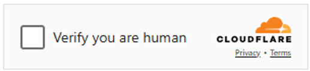
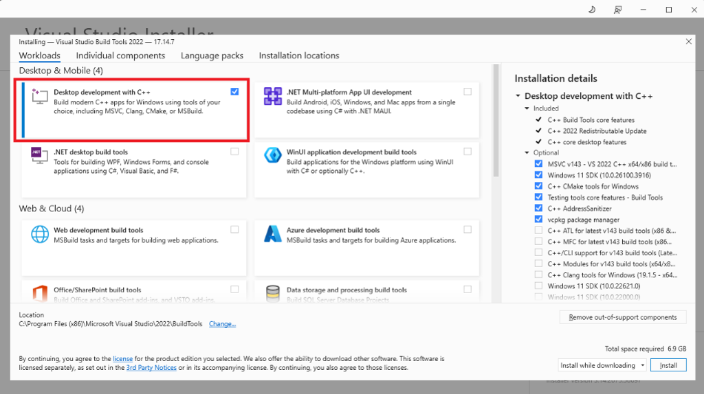

# Click the Cloudfalre Turnstile

This project demonstrates how to automatically click the Cloudflare Turnstile checkbox programmatically using Playwright and OpenCV. As Cloudflare continues to harden its bot protection systems, Turnstile now often requires a manual checkbox click, making automated interaction more challenging.



Our solution bypasses the limitations of cross-domain sandboxed iframes and locked Shadow DOM elements by leveraging image recognition to accurately locate and click the checkbox coordinates. The repository includes sample images (both light and dark mode) and a full code example using GhostCursor for more human-like interaction.

To ensure this solution works reliably, it is essential to use Kameleo with Playwright. Kameleo's anti-detect browsers (Chroma and Junglefox) mask your browser fingerprint and hide the fact that you are running in an automated environment. Without this stealth capability, Cloudflare is likely to detect your automation, which would result in repeated captchas even after the checkbox is clicked. See the "non-working example" in `playwright_opencv-not_working.js`.

For the full article and detailed explanation, visit: [Click the Cloudflare Turnstile – No bullshit](https://kameleo.io/blog/click-cloudflare-turnstile-checkbox).


## Setup & Run

1. Install [Visual C++ Build Tools](https://visualstudio.microsoft.com/visual-cpp-build-tools/). 
Make sure you select "Desktop development with C++" during installation

2. Install [CMake](https://cmake.org/) by running the following command as admin.
```
choco install cmake --installargs  'ADD_CMAKE_TO_PATH=System'
```

3. Make sure you restart your CMD
4. Run `npm install`
5. Run `npx opencv-build-npm`
6. Run `node script_opencv.js`

## Test Websites
Here are some websites you can use for testing Cloudflare

- https://2captcha.com/demo/cloudflare-turnstile  
- https://nopecha.com/captcha/turnstile  
- https://www.indeed.com/cmp/Burger-King/reviews